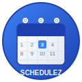

# Schedulez - Smart Home Management System

A comprehensive, lightweight Progressive Web App (PWA) for managing your daily life and schedule with intelligent planning features. Built for efficiency, accessibility, and offline functionality.

## 🚀 Live Demo

**[Try Schedulez Live →](https://rlvwebdev.github.io/schedulez/)**



## 🌟 Features

### Core Functionality
- **Daily Schedule Management** - Complete morning-to-night routine tracking
- **Weekly Task Organization** - Day-specific recurring tasks and cleaning schedules
- **Monthly Maintenance** - Long-term planning and deep cleaning cycles
- **TMS Development Tracking** - Dedicated time blocks for Transportation Management System development

### Technical Features
- 📱 **Progressive Web App** - Install on mobile and desktop
- 🔄 **Offline Support** - Works without internet connection
- 💾 **Local Storage** - Your data stays on your device
- 📊 **Dashboard Overview** - Quick stats and today's schedule
- ⚡ **Fast & Lightweight** - No external dependencies

## 🚀 Quick Start

### Option 1: Direct Use
1. Open `index.html` in your web browser
2. The app will load with default schedule templates
3. Start customizing your schedule immediately

### Option 2: Local Server (Recommended for PWA features)
```powershell
# Using Python (if installed)
python -m http.server 8000

# Using Node.js (if installed)
npx serve .

# Using PHP (if installed)
php -S localhost:8000
```
Then open http://localhost:8000 in your browser.

### Option 3: Install as PWA
1. Open the app in Chrome, Edge, or Safari
2. Look for the "Install" button or address bar install icon
3. Click "Install" to add to your home screen/desktop

## 📖 Usage Guide

### Getting Started
- **Dashboard**: Overview of your day and weekly development hours
- **Daily Schedule**: Your complete routine from 5:00 AM to 10:15 PM
- **Weekly Tasks**: Organized cleaning and maintenance by day
- **Monthly Tasks**: Deep cleaning cycles by week of month
- **Manage Events**: Create, edit, and delete all your scheduled items

### Adding New Events
1. Click the floating "+" button or use "Add New Event"
2. Fill in event details:
   - **Title**: What you need to do
   - **Time**: When to do it
   - **Category**: Personal, Dogs, Cleaning, Kitchen, Development, Maintenance
   - **Schedule Type**: Daily, Weekly, or Monthly
   - **Additional Details**: Day of week (weekly) or week of month (monthly)

### Categories Explained
- **Personal**: Morning routines, commute, relaxation
- **Dogs**: Pet care, walks, feeding, bathroom breaks
- **Cleaning**: Daily tidying, weekly deep cleans
- **Kitchen**: Meal prep, dishes, counter cleaning
- **Development**: TMS coding sessions and planning
- **Maintenance**: Home upkeep, yard work, repairs

## 🎯 Default Schedule Overview

### Daily Routine (5:00 AM - 10:15 PM)
- Morning routine and dog care (5:00-6:25 AM)
- Work commute and day
- Evening routine and TMS development (6:00-10:15 PM)

### Weekly Focus Areas
- **Monday**: Kitchen deep clean
- **Tuesday**: Living room focus
- **Wednesday**: Trash out & bedroom clean
- **Thursday**: Office & gaming room
- **Friday**: Laundry day
- **Saturday**: Yard work + 4hr TMS session
- **Sunday**: Rest & development prep + 4hr TMS session

### Monthly Deep Tasks
- **Week 1**: Deep bathroom & window cleaning
- **Week 2**: Basement & maintenance tasks
- **Week 3**: Pet care deep clean
- **Week 4**: Deep house cleaning

## 🔧 Customization

### Modifying Your Schedule
- Use "Manage Events" to edit any existing task
- Adjust times, descriptions, and categories as needed
- Add new categories by editing the code (future feature: custom categories)

### Data Management
- All data is stored locally in your browser
- Export/import functionality coming soon
- Clear browser data will reset to defaults

## 💻 Technical Details

### Built With
- **HTML5** - Semantic structure
- **CSS3** - Modern styling with gradients and animations
- **Vanilla JavaScript** - No external dependencies
- **Service Worker** - Offline functionality
- **LocalStorage** - Data persistence

### Browser Support
- Chrome/Edge: Full support including PWA installation
- Firefox: Core functionality (some PWA features limited)
- Safari: Core functionality with limited PWA support

### File Structure
```
schedulez/
├── index.html          # Main application
├── styles.css          # All styling and responsive design
├── script.js           # Application logic and data management
├── sw.js              # Service worker for offline support
├── manifest.json      # PWA manifest for installation
├── LICENSE            # MIT License
└── README.md          # This documentation
```

## 🤝 Contributing

### Issues & Suggestions
- Found a bug? Open an issue
- Have a feature request? Let us know
- Want to contribute? Fork and submit a PR

### Development Setup
1. Clone the repository
2. Open in your preferred code editor
3. Use a local server for testing PWA features
4. Make changes and test across browsers

## 📄 License

MIT License - See [LICENSE](LICENSE) file for details.

## 🆘 Support

### Common Issues
- **PWA not installing**: Ensure you're using HTTPS or localhost
- **Data not saving**: Check if browser storage is enabled
- **Offline not working**: Service worker needs HTTPS to function

### Getting Help
- Check the browser console for error messages
- Ensure JavaScript is enabled
- Try refreshing the page or clearing browser cache

---

**Version**: 1.0.0  
**Last Updated**: June 2025  
**Compatibility**: Modern browsers with ES6+ support
